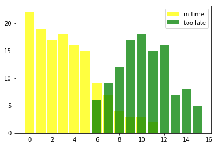
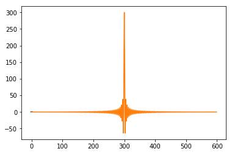

# NAIVE BAYES

* In machine learning, a Bayes classifier is a simple probabilistic classifier, which is based on applying Bayes' theorem.


```python
import matplotlib.pyplot as plt  # NAIVE BAYES CLASSIFIER.
in_time = [(0, 22), (1, 19), (2, 17), (3, 18),
           (4, 16), (5, 15), (6, 9), (7, 7),
           (8, 4), (9, 3), (10, 3), (11, 2)]
too_late = [(6, 6), (7, 9), (8, 12), (9, 17),
            (10, 18), (11, 15), (12, 16), (13, 7),
            (14, 8), (15, 5)]

%matplotlib inline


X, Y = zip(*in_time)

X2, Y2 = zip(*too_late)

bar_width = 0.9
plt.bar(X, Y, bar_width,  color="yellow", alpha=0.75, label="in time")
bar_width = 0.8
plt.bar(X2, Y2, bar_width,  color="green", alpha=0.75, label="too late")
plt.legend(loc='upper right')
plt.show()
```





```python
# Python3 program to swap first
# and last element of a list
# Swap function


def swapList(newList):
    size = len(newList)
    # Swapping
    temp = newList[0]
    newList[0] = newList[size - 1]
    newList[size - 1] = temp
    return newList


# Driver code
newList = [12, 35, 9, 56, 24]
print(swapList(newList))

import pandas as pd
```

    [24, 35, 9, 56, 12]
​    


```python
pd.DataFrame()
```


```python
import matplotlib.pyplot as plt
import scipy
from scipy.fftpack import fftshift
import numpy as np

x = np.arange(-3, 3, 0.01)            # LAPLACE ESTIMATOR.
y = np.zeros(len(x))
y[150:450] = 1
plt.plot(x, y) # plot of the step function

yShift = fftshift(y) # shift of the step function
Fourier = scipy.fft(yShift) # Fourier transform of y implementing the FFT
Fourier = fftshift(Fourier) # inverse shift of the Fourier Transform
plt.plot(Fourier)
```

    D:\PYTHON_PRACTICE\lib\site-packages\numpy\core\numeric.py:501: ComplexWarning: Casting complex values to real discards the imaginary part
      return array(a, dtype, copy=False, order=order)


    [<matplotlib.lines.Line2D at 0x23b6759eda0>]





```python
import random
def coin_trial():
    heads = 0
    for i in range(100):
        if random.random()<= 0.5:                  # TOTAL PROBABILITY.
            heads +=1
            return heads
     def simulate(n):
        trials = []
        for i in range(n):
              trials.append(coin_trial())
    return(sum(trials)/n)
    
```


      File "<ipython-input-18-346dea32c593>", line 8
        def simulate(n):
                        ^
    IndentationError: unindent does not match any outer indentation level


```python
import statistics  
sample = [2.74, 1.23, 2.63, 2.22, 3, 1.98]  
print("Variance of sample set is % s"         # VARIANCE.
      %(statistics.variance(sample)))
```

    Variance of sample set is 0.40924
​    


```python
import math 
   
sample = [1, 2, 3, 4, 5] 
   
print("Standard Deviation of the sample is % s "   # STANDARD DEVIATION AND VARIANCE.
                    %(statistics.stdev(sample))) 
   
print("Variance of the sample is % s" 
     %(statistics.variance(sample))) 
```

    Standard Deviation of the sample is 1.5811388300841898 
    Variance of the sample is 2.5


```python
import numpy as np 
  
x = [1, 2, 3, 4] 
  
y = [4, 5, 6, 7] 
  
cov_mat = np.stack((x, y), axis = 0)  
  
print(np.cov(cov_mat))
```

    [[1.66666667 1.66666667]
     [1.66666667 1.66666667]]


```python
import numpy.linalg as m

matrix1 = np.matrix([[1, 2], [3, 4]])
matrix1
m.det(matrix1)
```


    -2.0000000000000004


```python
n_num = [25, 55, 65]
n = len(n_num)
n_num.sort()

if n % 2 == 0:
    median1 = n_num[n//2]
    median2 = n_num[n/2-1]
    median = (median1 + median2)/2
else:
    median = n_num[n//2]
    print("Median is: " + str(median))
```

    Median is: 55
​    


```python
import math
x = (5, 6, 7)
y = (8, 9, 9)
distance = math.sqrt(sum([(a - b) ** 2 for a, b in zip(x, y)]))
print("Euclidean distance from x to y: ", distance)
```

    Euclidean distance from x to y:  4.69041575982343
​    


```python
import sympy
x = sympy.Symbol('x')
sympy.diff(x**2+2*x, x)
```


    2*x + 2


```python
from scipy.integrate import quad


def integrand(x):
    return x**2


ans, err = quad(integrand, 0, 1)
print(ans)
```

    0.33333333333333337
​    


```python

```
